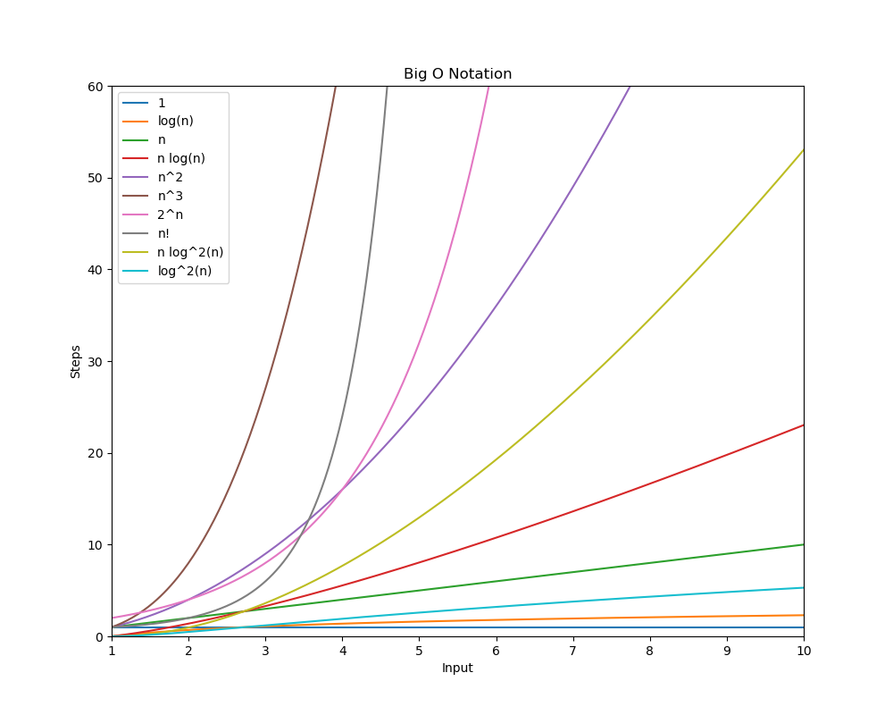

# Sorting Algorithms

Sorting Algorithms are algorithms that put elements of a list in a certain order. They are used to arrange data to make it more accessible and easier to use, this mostly because of the ease to understand the data and the ease to find specific elements.

The most common sorting algorithms are:

- Bubble Sort
- Improved Bubble Sort
- Selection Sort
- Insertion Sort
- Merge Sort
- Quick Sort
- Heap Sort
- Radix Sort
- Shell Sort
- Bogosort(Not really a sorting algorithm)

## Bubble Sort

Bubble sort is a simple sorting algorithm that repeatedly steps through the list, compares adjacent elements and swaps them if they are in the wrong order. The pass through the list is repeated until the list is sorted. The algorithm, which is a comparison sort, is named for the way smaller or larger elements "bubble" to the top of the list.

```c++
template<typename T>
void bubbleSort(std::vector<T>& arr){
  auto n = arr.size();
  for (unsigned long i = 0; i < n-1; ++i) {
    for (unsigned long j = 0; j < n-i-1; ++j) {
      if (arr[j] > arr[j + 1]) {
        T temp = arr[j];
        arr[j] = arr[j + 1];
        arr[j + 1] = temp;
      }
    }
  }
}
```

## Improved Bubble Sort

An improvement on the bubble sort algorithm is to stop the algorithm if inner loop didn't cause any swap. This means that the array is already sorted.

```c++
template<typename T>
void improvedBubbleSort(std::vector<int>& arr){
  auto n = arr.size();
  bool swapped;
  for (unsigned long i = 0; i < n-1; ++i) {
    swapped = false;
    for (unsigned long j = 0; j < n-i-1; ++j) {
      if (arr[j] > arr[j + 1]) {
        int temp = arr[j];
        arr[j] = arr[j + 1];
        arr[j + 1] = temp;
        swapped = true;
      }
    }
    if(!swapped){
      break;
    }
  }
}
```

## Selection Sort

Selection sort, the most simple of the sorting algorithms, with the obious exception of bubble sort, is an in-place comparison sorting algorithm. It has an O(n^2) time complexity, which makes it inefficient on large lists, and generally performs worse than the similar insertion sort. Selection sort is noted for its simplicity, and it has performance advantages over more complicated algorithms in certain situations, particularly where auxiliary memory is limited.

```c++
#include <vector>

// Function to swap values at two pointers
inline void swap (int &a, int &b) {
  int temp = a;
  a = b;
  b = temp;
}

// Function to perform selection sort on arr[]
void selectionSort(std::vector<int>& arr) {
  for (int i = 0; i < static_cast<int>(arr.size()) - 1; ++i) {
    int min_idx = i;
    for (int j = i + 1; j < static_cast<int>(arr.size()); ++j)
      if (arr[j] < arr[min_idx])
        min_idx = j;
    swap(arr[min_idx], arr[i]);
  }
}
```
Note: as you can see this algorithm requires the use of the swap function, which is defined in the code above.

## Insertion Sort

Insertion sort is a simple sorting algorithm that builds the final sorted array (or list) one item at a time. It is much less efficient on large lists than more advanced algorithms such as quicksort, heapsort, or merge sort. However, insertion sort provides several advantages:

- Simple implementation: Jon Bentley shows a three-line C version, and a five-line optimized version
- Efficient for (quite) small data sets, much like other quadratic sorting algorithms
- More efficient in practice than most other simple quadratic (i.e., O(n2)) algorithms such as selection sort or bubble sort
- Adaptive, i.e., efficient for data sets that are already substantially sorted: the time complexity is O(kn) when each element in the input is no more than k places away from its sorted position
- Stable; i.e., does not change the relative order of elements with equal keys
- In-place; i.e., only requires a constant amount O(1) of additional memory space

```c++
template <typename Comparable>
void insertionSort(std::vector<Comparable>& a) {
  // Iterate over each element in the vector
  for (size_t p = 1; p < a.size(); ++p) {
    // Use std::move for efficiency when dealing with large objects
    Comparable tmp = std::move(a[p]);
    size_t j;

    // Find the correct position for the current element in the sorted part of the array
    for(j = p; j > 0 && tmp < a[j - 1]; --j) {
      a[j] = std::move(a[j - 1]);
    }

    // Place the current element in the correct position
    a[j] = std::move(tmp);
  }
}
```

## Shell sort

Shell sort(named after it's inventor Donald Shell) is a generalization of insertion sort that allows the exchange of items that are far apart. The idea is to arrange the list of elements so that, starting anywhere, considering every hth element gives a sorted list. Such a list is said to be h-sorted. Equivalently, it can be thought of as h interleaved lists, each individually sorted. Beginning with large values of h, this rearrangement allows elements to move long distances in the original list, reducing large amounts of disorder quickly, and leaving less work for smaller h-sort steps to do. If the list is then k-sorted for some smaller integer k, then the list remains h-sorted. Following this idea for a decreasing sequence of h values ending in 1 is guaranteed to leave a sorted list in the end.

```c++
void shellSort(std::vector<int>& arr){
  int n = arr.size();

  // Start with a big gap, then reduce the gap
  for (int gap = n/2; gap > 0; gap /= 2){
    // Do a gapped insertion sort for this gap size.
    // The first gap elements arr[0..gap-1] are already in gapped order
    // keep adding one more element until the entire array is gap sorted
    for (int i = gap; i < n; i += 1){
      // add arr[i] to the elements that have been gap sorted
      // save arr[i] in temp and make a hole at position i
      int temp = arr[i];

      // shift earlier gap-sorted elements up until the correct location for arr[i] is found
      int j;
      for (j = i; j >= gap && arr[j - gap] > temp; j -= gap)
        arr[j] = arr[j - gap];

      // put temp (the original arr[i]) in its correct location
      arr[j] = temp;
    }
  }
}
```

Note that this is the first algorithm able to sort a vector in O(n log n) time. This is because the algorithm is able to sort the vector in O(n) time for a specific gap, and the gap is reduced by a factor of 2 each time, which means that the algorithm will run in O(log n) time. This means that the algorithm will run in O(n log n) time.

## Merge Sort

Merge sort is an efficient, general-purpose, comparison-based sorting algorithm. Most implementations produce a stable sort, which means that the order of equal elements is the same in the input and output. Merge sort is a divide and conquer algorithm that was invented by John von Neumann in 1945.

Conceptually, a merge sort works as follows:

- Divide the unsorted list into n sublists, each containing one element (a list of one element is considered sorted).
- Repeatedly merge sublists to produce new sorted sublists until there is only one sublist remaining. This will be the sorted list.

```c++
template <typename T>
void merge(std::vector<T>& array, int const left, int const mid, int const right){
    std::vector<T> leftArray(array.begin() + left, array.begin() + mid + 1);
    std::vector<T> rightArray(array.begin() + mid + 1, array.begin() + right + 1);

    auto leftIndex = 0, rightIndex = 0, mergeIndex = left;
    while (leftIndex < leftArray.size() && rightIndex < rightArray.size()) {
        if (leftArray[leftIndex] <= rightArray[rightIndex]) {
            array[mergeIndex] = leftArray[leftIndex++];
        }
        else {
            array[mergeIndex] = rightArray[rightIndex++];
        }
        mergeIndex++;
    }
    auto arrayIndex = mergeIndex;
    arrayIndex = std::copy(leftArray.begin() + leftIndex, leftArray.end(), array.begin() + arrayIndex) - array.begin();
    std::copy(rightArray.begin() + rightIndex, rightArray.end(), array.begin() + arrayIndex);
}

// Main MergeSort function: sorts the array using the divide-and-conquer approach
template <typename T>
void mergeSort(std::vector<T>& array, int const begin, int const end){
  if (begin < end) {
    auto mid = begin + (end - begin) / 2;
    mergeSort(array, begin, mid);
    mergeSort(array, mid + 1, end);
    merge(array, begin, mid, end);
  }
}
```

## Quick Sort

Quicksort is an efficient sorting algorithm. Developed by British computer scientist Tony Hoare in 1959 and published in 1961, it is still a commonly used algorithm for sorting. When implemented well, it can be about two or three times faster than its main competitors, merge sort and heapsort. Quicksort is a divide-and-conquer algorithm. It works by selecting a 'pivot' element from the array and partitioning the other elements into two sub-arrays, according to whether they are less than or greater than the pivot. The sub-arrays are then sorted recursively. This can be done in-place, requiring small additional amounts of memory to perform the sorting.

```c++
// Function to swap values at two pointers
inline void swap(int* a, int* b) { 
  int t = *a;
  *a = *b;
  *b = t;
}

/* This function takes last element as pivot, places the pivot element at its correct position in sorted array, and places all smaller (smaller than pivot)
to left of pivot and all greater elements to right of pivot */
int partition (std::vector<int> &arr, int low, int high) {
  int pivot = arr[high];  // pivot
  int i = (low - 1);  // Index of smaller element

  for (int j = low; j <= high - 1; j++) {
    // If current element is smaller than the pivot
    if (arr[j] < pivot) {
      i++;  // increment index of smaller element
      swap(&arr[i], &arr[j]);
    }
  }
  swap(&arr[i + 1], &arr[high]);
  return (i + 1);
}

/* The main function that implements QuickSort 
 arr --> Array to be sorted, 
 low  --> Starting index, 
 high  --> Ending index */
void quickSort(std::vector<int> &arr, int low, int high) {
  if (low < high) {
    /* pi is partitioning index, arr[pi] is now
    at right place */
    int pi = partition(arr, low, high);

    // Separately sort elements before
    // partition and after partition
    quickSort(arr, low, pi - 1);
    quickSort(arr, pi + 1, high);
  }
}

// Function to call quicksort routine
void quickSort(std::vector<int> &arr){
  quickSort(arr, 0, arr.size()-1);
}
```

## Heap Sort

Heapsort is a comparison-based sorting algorithm. It is an in-place comparison sorting algorithm. It has O(n log n) complexity, hence the name. Heapsort is a comparison-based algorithm. It uses a binary heap data structure. It is similar to selection sort, where we first find the maximum element and place the maximum element at the end. We repeat the same process for the remaining elements.

```c++
// To heapify a subtree rooted with node i which is an index in arr[]. n is size of heap
void heapify(std::vector<int> &arr, int n, int i) {
  int largest = i;  // Initialize largest as root
  int l = 2 * i + 1;  // left = 2*i + 1
  int r = 2 * i + 2;  // right = 2*i + 2

  // If left child is larger than root
  if (l < n && arr[l] > arr[largest])
    largest = l;

  // If right child is larger than largest so far
  if (r < n && arr[r] > arr[largest])
    largest = r;

  // If largest is not root
  if (largest != i) {
    swap(arr[i], arr[largest]);

    // Recursively heapify the affected sub-tree
    heapify(arr, n, largest);
  }
}

// main function to do heap sort
void heapSort(std::vector<int> &arr) {
  int n = arr.size();

  // Build heap (rearrange array)
  for (int i = n / 2 - 1; i >= 0; i--)
    heapify(arr, n, i);

  // One by one extract an element from heap
  for (int i = n - 1; i >= 0; i--) {
    // Move current root to end
    swap(arr[0], arr[i]);

    // call max heapify on the reduced heap
    heapify(arr, i, 0);
  }
}
```

## Radix Sort

Radix, is a method of sorting digits in a numerical sequence. It is a simple sorting algorithm that works by selecting a digit at a time, counting the number of digits in the number, and then sorting the digits in descending order. Its advantage over other sorting algorithms is that it is very fast and can be used for sorting large numbers of digits. It is also very easy to implement.

```c++
// A utility function to get maximum value in arr[]
int getMax(std::vector<int> &arr, int n) {
  int mx = arr[0];
  for (int i = 1; i < n; i++)
    if (arr[i] > mx)
      mx = arr[i];
  return mx;
}

// A function to do counting sort of arr[] according to the digit represented by exp.
void countSort(std::vector<int> &arr, int n, int exp) {
  int output[n];  // output array
  int i, count[10] = {0};

  // Store count of occurrences in count[]
  for (i = 0; i < n; i++)
    count[(arr[i] / exp) % 10]++;

  // Change count[i] so that count[i] now contains actual position of this digit in output[]
  for (i = 1; i < 10; i++)
    count[i] += count[i - 1];

  // Build the output array
  for (i = n - 1; i >= 0; i--) {
    output[count[(arr[i] / exp) % 10] - 1] = arr[i];
    count[(arr[i] / exp) % 10]--;
  }

  // Copy the output array to arr[], so that arr[] now contains sorted numbers according to current digit
  for (i = 0; i < n; i++)
    arr[i] = output[i];
}

// The main function to that sorts arr[] of size n using Radix Sort

void radixSort(std::vector<int> &arr) {
  // Find the maximum number to know number of digits
  int m = getMax(arr, arr.size());

  // Do counting sort for every digit. Note that instead of passing digit number, exp is passed. exp is 10^i where i is current digit number
  for (int exp = 1; m / exp > 0; exp *= 10)
    countSort(arr, arr.size(), exp);
}
```

## Bogosort

Not really a sorting algorithm, but it is a fun one. Bogosort is a highly ineffective sorting function based on the generate and test paradigm. The function successively generates permutations of its input until it finds one that is sorted. It is not useful for sorting, but may be used for educational purposes, to contrast it with more efficient algorithms.

```c++
// To check if array is sorted or not
bool isSorted(std::vector<int> &arr) {
  for (int i = 1; i < arr.size(); i++)
    if (arr[i] < arr[i - 1])
      return false;
  return true;
}

// To generate permuatation of the array
void shuffle(std::vector<int> &arr) {
  for (int i = 0; i < arr.size(); i++)
    swap(arr[i], arr[rand() % arr.size()]);
}

// Sorts array a[0..n-1] using Bogo sort
void bogosort(std::vector<int> &arr) {
  // if array is not sorted then shuffle the
  // array again
  while (!isSorted(arr))
    shuffle(arr);
}
```

To finish this section, here is a table with the time complexities of each algorithm:

| Algorithm       | Time Complexity | Space Complexity |
|-----------------|-----------------|------------------|
| Bubble          | O(n^2)          | O(1)             |
| Improved Bubble | O(n^2)          | O(1)             |
| Selection       | O(n^2)          | O(1)             |
| Insertion       | O(n^2)          | O(1)             |
| Shell           | O(n log n)      | O(1)             |
| Merge           | O(n log n)      | O(n)             |
| Quick           | O(n log n)      | O(log n)         |
| Heap            | O(n log n)      | O(1)             |
| Radix           | O(nk)           | O(n+k)           |
| Bogosort        | O(n*n!)         | O(1)             |


Added image to refer the complexity of each algorithm:


