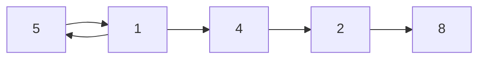

# Sorting Algorithms

## What is sorting?

Sorting is the process of rearranging the items in a collection (e.g. an array) so that the items are in some kind of order.

## Why do we need to learn this?

Sorting is an incredibly common task, from the elements in a list of numbers to the way we organize our files on our computer.

## Sorting Algorithms

- Bubble Sort
- Selection Sort
- Insertion Sort
- Merge Sort
- Quick Sort
- Radix Sort
- Bogo Sort

### Bubble Sort

The most basic of sorting algorithms, bubble sort works by comparing two adjacent elements and swapping them if they are not in the desired order. This process is repeated until the array is sorted.

```c++

void bubbleSort(int arr[], int n)
{
    for (int i = 0; i < n - 1; i++)
    {
        for (int j = 0; j < n - i - 1; j++)
        {
            if (arr[j] > arr[j + 1])
            {
                swap(arr[j], arr[j + 1]);
            }
        }
    }
}
```

This algorithm is called bubble sort because with each iteration, the largest element bubbles up to the top of the array.



Bubble sort is not a very efficient algorithm, as it has a time complexity of $O(n^2)$. This means that for an array of size $n$, it will take $n^2$ iterations to sort the array.

This means that if as an example the sorting operation took 1s per operation for an array of 1000 elements, it would take 1000 seconds to sort which is about 16 minutes.

### Selection Sort

Selection sort works by finding the smallest element in the array and swapping it with the first element. Then, it finds the second smallest element and swaps it with the second element, and so on.

```c++
void selectionSort(int arr[], int n)
{
    for (int i = 0; i < n - 1; i++)
    {
        int minIndex = i;
        for (int j = i + 1; j < n; j++)
        {
            if (arr[j] < arr[minIndex])
            {
                minIndex = j;
            }
        }
        swap(arr[i], arr[minIndex]);
    }
}
```

### Insertion Sort

Insertion sort works by iterating through the array and inserting each element into its correct position in a sorted subarray.

```c++
void insertionSort(int arr[], int n)
{
    for (int i = 1; i < n; i++)
    {
        int j = i - 1;
        int key = arr[i];
        while (j >= 0 && arr[j] > key)
        {
            arr[j + 1] = arr[j];
            j--;
        }
        arr[j + 1] = key;
    }
}
```

### Merge Sort

Merge sort is a divide and conquer algorithm that works by splitting the array into two halves, sorting each half, and then merging the two sorted halves.

```c++
void mergeSort(int arr[], int l, int r)
{
    if (l < r)
    {
        int m = (l + r) / 2;
        mergeSort(arr, l, m);
        mergeSort(arr, m + 1, r);
        merge(arr, l, m, r);
    }
}

### Shell Sort

Shellsort (named like that because it was invented by Donald Shell) is a variation of insertion sort that works by sorting elements that are far apart from each other and then reducing the gap between elements to be sorted.

```c++
void shellSort(int arr[], int n)
{
    for (int gap = n / 2; gap > 0; gap /= 2)
    {
        for (int i = gap; i < n; i++)
        {
            int temp = arr[i];
            int j;
            for (j = i; j >= gap && arr[j - gap] > temp; j -= gap)
            {
                arr[j] = arr[j - gap];
            }
            arr[j] = temp;
        }
    }
}
```
